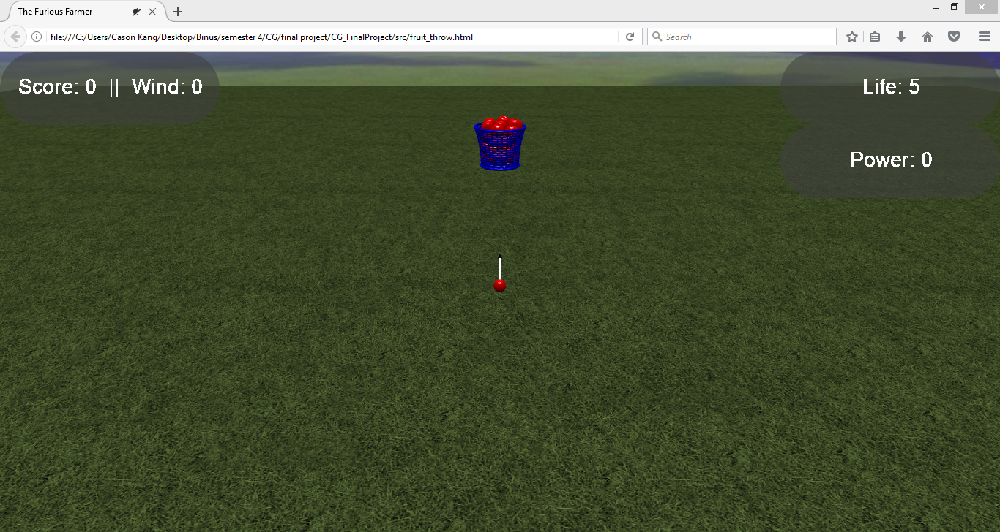
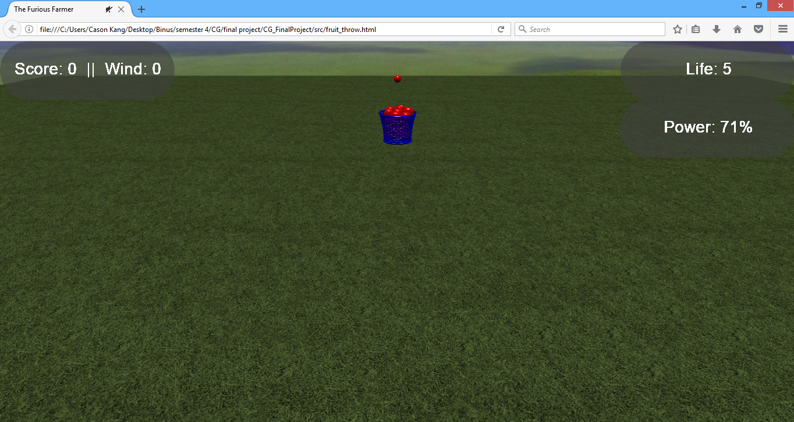

<h1>THE FURIOUS FARMER</h1>

 
Revision: 0.0.0

Final Project Report
Game Design Development

COMP6205 – Computer Graphics
Computer Science Program
Bina Nusantara University International
2016/2017 
License 
If you use this in any of your games. Give credit in the GDD (this document) to Alec Markarian and Benjamin Stanley. We did work so you don’t have to.   

Feel free to Modify, redistribute but not sell this document.

TL;DR - Keep the credits section of this document intact and we are good and do not sell it.

Table of Content
Overview
Theme / Setting / Genre
Project Description
Core Gameplay Mechanics Brief
Targeted platforms
Project Scope
Story and Gameplay
Story
Gameplay
Assets Needed
- 2D
- 3D
- Sound
Full Coding
- <Put your group CS Github url/link>
Screenshot of the Game

Overview

Theme / Setting / Genre
	- Casual Point Collection game
	- Apple Plantation setting

Project Description 
Our group consists of two members Cason (in charge of GUI and Models) and Dhyatmika Suriyanto (in charge of game mechanics). This is a game we created for our final project in the Computer Graphics course at Binus International. 
We came up with the project idea based on paper toss as our inspiration but instead of paper toss we changed it into apple toss and called it The Furious Farmer. Our game is a web based game made with Babylon.js. The Goal of the game is to throw an apple into a basket and score the most points.
To make the game more challenging we added physics, life and wind. And the user can also adjust the power of each shot. We also added sound and a lot of models to make the game more pleasing to look at aesthetically 

How to play the game
-	First clone or download the whole project
-	In the src folder you will find fruit_throw.html
-	Open fruit_throw.html with a browser (preferably Mozilla)
-	Enjoy the game

 
Core Gameplay Mechanics Brief
- Physics: the game uses the CannonJS physics plugin to simulate the gravity and wind happening inside the game
- Power: in the game the player can control the power of each throw which controls the amount of force applied to the apple.
	- Life: in the game the player can miss no more than 5 shots.
	- Points: each successful throw to the basket counts as one point.
	- Controls: The main controls of the game are A,W,S,D,Space and R
			- a,w,s and d to control the arrow direction
			- Space to control power
			- R to reset the ball to the original position
Targeted platforms
	- Web: This game is made to be a web based game played on browsers.

Limitations
	-	If the apple falls off the arena the apple cannot be reset into place

Project Scope 
	- The project took about one month to complete including the model preparation and mechanics.
- Core Team
	- Cason 1901521236 + Casoncase (Gitlab account)
			- In charge of GUI, Models and Sound.
- Dhyatmika Suriyanto 1901521255 + dhyatmika.s (Gitlab account)
			- In charge of game mechanics.
	- Libraries Used 
		- Babylon.js
		- Hand.js

	- Programs used during development
		- Blender
		- Sublime text
		- Atom

Story and Gameplay

Story 

The story of the game is about a farmer who is harvesting his apples. Unfortunately, some of his apples turned out to be small. The farmer becomes enraged and decides to throw the apples into the basket instead of placing them into the basket slowly. After the first few throws the wind suddenly starts to become stronger making the throws more challenging. The furious farmer slowly starts to enjoy throwing the apple and decides to count how many he can get in. The more he misses the more furious he gets if the farmer misses more than 5 throws he will lose his patience and stop throwing apples.
Gameplay 

The game starts in a field with an apple aimed at the basket. There is a board for score and wind on the left top corner and life and power at the right top corner. The player’s task is to aim and throw the apple to the basket. The player will get 5 lives and each time he throws and resets the apple there is a 60% chance that the wind will change. The range of wind is from -10 to +10 a negative value means that the wind blows to the left while a positive value means that it will blow to the right. The controls of the game are a,w,s and d for aiming the apple, space for controlling the power and r to reset the ball to the original position. If the apple reaches the goal it will automatically be placed back to the original position while if it misses the player should reset the ball at the cost of one life. When the life reaches 0 the player’s final score will be shown on screen and the game will reset.
Assets Needed

- 2D
	- Textures
		- Grass.png
- Skybox
		- grass_nx.jpg
- grass_ny.jpg
- grass_nz.jpg
- grass_px.jpg
- grass_py.jpg
- grass_pz.jpg
- 3D
	- Environmental Art Lists
		- Apple.babylon
		- Basket.babylon
		- manyApples.babylon
- Sound
	- Sound effects
		- bgm.mp3
		- yay.mp3
		- end.mp3

Full Coding
	- https://github.com/CSBinusInternational/L4BC-Group-2
		

Screenshot of the Game
 

Start Screen

Gameplay

End Screen
